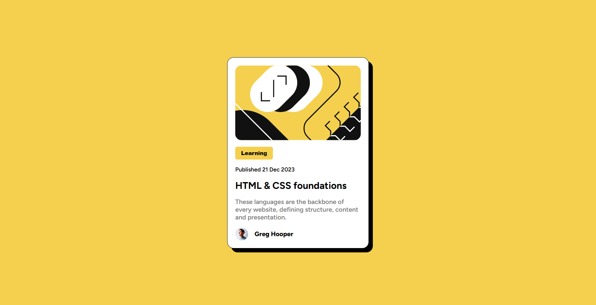

# Frontend Mentor - Blog preview card solution

This is a solution to the [Blog preview card challenge on Frontend Mentor](https://www.frontendmentor.io/challenges/blog-preview-card-ckPaj01IcS). Frontend Mentor challenges help you improve your coding skills by building realistic projects. 

## Table of contents

- [Overview](#overview)
  - [The challenge](#the-challenge)
  - [Screenshot](#screenshot)
  - [Links](#links)
- [My process](#my-process)
  - [Built with](#built-with)
  - [What I learned](#what-i-learned)
  - [Continued development](#continued-development)
- [Author](#author)


## Overview

### The challenge

Users should be able to:

- See hover and focus states for all interactive elements on the page

### Screenshot




### Links

- Solution URL: [Github Solution](https://github.com/AashishVivekBhat/blog_preview)
- Live Site URL: [Live Site](https://your-live-site-url.com)

## My process

### Built with

- Semantic HTML5 markup
- CSS custom properties
- Flexbox
- Mobile-first workflow


### What I learned

- Writing semantic HTML using ```<main>, <h1>``` tags to improve accessibility & organisation

- Responsive design while writing meaningful code to improve readability and future improvements/contributions.

- CSS properties & concepts like 'Flexbox', @font-face, variables etc and their syntax for writing concise & organized code.


### Continued development

- Focus on getting better at responsive design, needs improvements in efficiency of tasks like visualizing, writing and implementation of simple designs

- Improving project completion time w.r.t earlier projected time-frame.

## Author

- Frontend Mentor - [@AashishVivekBhat](https://www.frontendmentor.io/profile/aashishvivekbhat)
